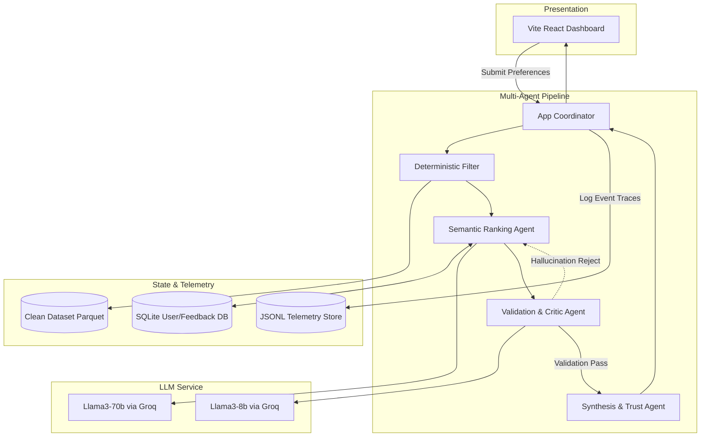
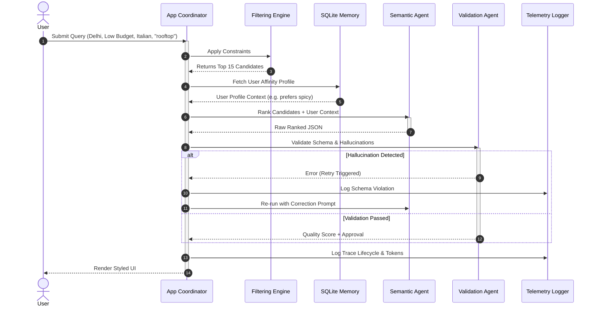

de# System Architecture: AI-Powered Restaurant Decision Support System

This document outlines the detailed system architecture, component design, data flow, schema representations, and integration patterns for the Zomato-inspired Production-Grade AI Decision Support System.

---

## 1. Architectural Style & Design Principles

The system is designed using a **Multi-Agent Orchestration Architecture** tailored for intelligent, operational AI applications.

### Core Design Principles:
1. **Deterministic-First Filtering:** Raw datasets are pruned using high-performance deterministic rules (Pandas queries) *before* reaching the AI.
2. **Multi-Agent Validation:** A pipelined approach (Ranker $\rightarrow$ Critic $\rightarrow$ Synthesizer) guarantees zero hallucinations and strictly enforced schemas.
3. **Observability & Evaluation:** Comprehensive JSON-based telemetry traces every request, measuring latency, token usage, and automated quality scores.
4. **Resiliency & Cost-Aware Routing:** The architecture routes simple queries to fast, cheap models and complex semantic queries to large reasoning models.

---

## 2. High-Level Component Decomposition

The system consists of five primary layers:



### Component Details:

*   **App Coordinator:** Manages the entire request lifecycle, handles failures, and fires telemetry events.
*   **Semantic Ranking Agent:** Takes the pruned deterministic candidate list and ranks it based on complex qualitative inputs, accessing user SQLite memory profiles if present.
*   **Validation & Critic Agent:** Acts as an LLM-based gatekeeper. Scans the Ranker's output to ensure no hallucinations (fake restaurants) were injected.
*   **Synthesis & Trust Agent:** Generates transparent UI elements (e.g., Confidence Scores, Widening Explanations).
*   **Local SQLite DB:** Stores human feedback (`thumbs up/down`) and automatically extracts user cuisine affinities for future personalization.

---

## 3. Data Schema & Contracts

### A. Raw Hugging Face Dataset Schema
*(See Data Ingestion Logic for full Pandas transformations)*

### B. LLM Output Structure (JSON Schema Contract)
To ensure the LLM returns reliable, machine-readable JSON, the application enforces the following response schema across the final Synthesis Agent:

```json
{
  "$schema": "http://json-schema.org/draft-07/schema#",
  "title": "RestaurantRecommendations",
  "type": "object",
  "properties": {
    "confidence_score": { "type": "number", "description": "Score from 1-100 indicating quality of match" },
    "recommendations": {
      "type": "array",
      "items": {
        "type": "object",
        "properties": {
          "restaurant_name": { "type": "string" },
          "rank": { "type": "integer" },
          "cuisine": { "type": "string" },
          "rating": { "type": "number" },
          "estimated_cost_tier": { "type": "string", "enum": ["Low", "Medium", "High"] },
          "justification": { "type": "string" }
        },
        "required": ["restaurant_name", "rank", "cuisine", "rating", "estimated_cost_tier", "justification"]
      }
    }
  },
  "required": ["confidence_score", "recommendations"]
}
```

### C. Telemetry Event Schema
Every request generates structured JSON lines in `telemetry.jsonl`.

```json
{
  "trace_id": "req-12345",
  "timestamp": "2026-05-27T10:00:02Z",
  "event_type": "AGENT_CRITIC_REJECT",
  "reason": "HALLUCINATION_DETECTED",
  "offending_entity": "Fake Cafe Name",
  "retry_attempt": 1
}
```

---

## 4. End-to-End System Data Flow



---

## 5. Non-Functional Architecture & Optimizations

*   **Caching Strategy:**
    *   **Prompt Caching:** Hashing the deterministic candidate IDs and user preferences. Matches bypass the LLM orchestration completely to save 100% token cost.
*   **Cost-Aware Routing:**
    *   Simple deterministic queries without subjective constraints skip the heavy 70b Ranker and fall back directly to an 8b model for ultra-fast summarization.
*   **Error Boundaries & Graceful Degradation:**
    *   If the Validation Agent fails repeatedly, the system safely falls back to displaying the deterministic Pandas query results ranked strictly by rating and vote count.
