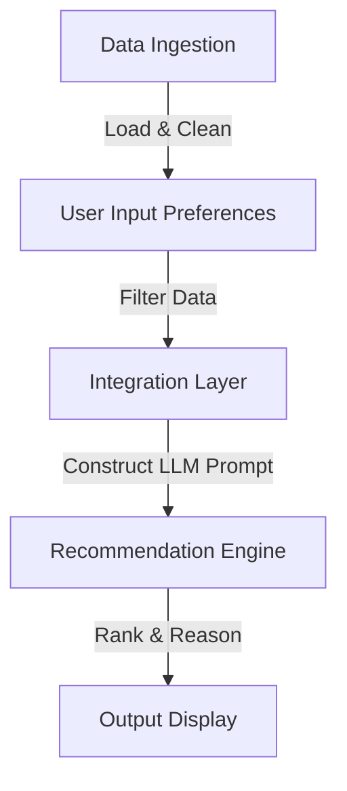

# Project Context: AI-Powered Restaurant Recommendation System (Zomato Use Case)

This document provides a comprehensive overview of the project's background, objectives, system architecture, workflow, and technology considerations for building an AI-powered restaurant recommendation system inspired by Zomato.

---

## 1. Project Overview & Objective

The goal of this project is to build an **AI-powered restaurant recommendation service** that replicates the intelligent, user-centric suggestion capabilities of platform leaders like Zomato. Instead of relying solely on rigid, deterministic filters, this system marries structured, real-world restaurant data with the reasoning capabilities of a **Large Language Model (LLM)**. 

### Core Objectives:
*   **Structured Filtering & Semantic Reasoning:** Combine structured metadata (e.g., cuisine, cost, location, ratings) with natural language processing to produce nuanced, context-aware suggestions.
*   **Personalization:** Leverage LLMs to interpret diverse, fuzzy user preferences (e.g., "romantic atmosphere," "child-friendly budget eats") and deliver custom ranking decisions.
*   **Explainability:** Provide clear, human-like reasoning explaining *why* each restaurant was recommended, boosting user trust and engagement.

---

## 2. System Workflow & Architecture

The application is structured around a five-stage data and intelligence pipeline:

### Phase 1: Data Ingestion & Preprocessing
*   **Dataset Source:** Hugging Face [`ManikaSaini/zomato-restaurant-recommendation`](https://huggingface.co/datasets/ManikaSaini/zomato-restaurant-recommendation).
*   **Target Fields:**
    *   `Restaurant Name`
    *   `Location` / `City`
    *   `Cuisines`
    *   `Average Cost for two` / `Budget Tier`
    *   `Aggregate Rating`
    *   `Votes` / `Reviews` (if available for contextual filtering)
*   **Preprocessing Tasks:** Parsing clean locations, converting text-based budgets into comparable numeric scales or tiers (low, medium, high), and handling missing ratings.

### Phase 2: User Input Collection
The system gathers rich user criteria to drive the filtering:
*   **Location:** Target city or area (e.g., Delhi, Bangalore).
*   **Budget Tier:** Categorized as low, medium, or high.
*   **Cuisine Preference:** Italian, Chinese, North Indian, Street Food, etc.
*   **Minimum Rating Threshold:** Filter out lower-rated options (e.g., minimum 4.0/5.0).
*   **Fuzzy/Qualitative Preferences:** Open-ended requirements (e.g., "family-friendly," "rooftop seating," "quick bite," "romantic").

### Phase 3: Integration Layer
*   **Data Partitioning:** Apply deterministic filters (Location, Budget, Cuisines, Ratings) first to prune the Hugging Face dataset down to a highly relevant candidate pool.
*   **Prompt Construction:** Assemble the matching candidate restaurants along with their metadata into a structured payload for the LLM. 
*   **System Prompting:** Instruct the LLM to behave as a professional food guide/connoisseur, formatting instructions, and enforcing constraints (such as refusing to recommend outside the user's requested budget tier or location).

### Phase 4: Recommendation Engine (LLM Pipeline)
*   **LLM Role:**
    *   Analyze candidate restaurants against qualitative user preferences.
    *   Rank the top recommendations based on alignment with the user profile.
    *   Synthesize a concise, engaging, and personalized explanation for *why* each choice is perfect for the user.

### Phase 5: Output Display
Present recommendations in a polished, highly readable format showing:
1.  **Restaurant Name**
2.  **Cuisine Type**
3.  **Rating & Popularity**
4.  **Estimated Cost**
5.  **AI-Generated Justification / Review Summary**

---

## 3. Recommended Technology Stack

For building a robust, modern, and rapid prototype or production app, the following stack is recommended:

*   **Language & Data Processing:**
    *   **Python:** The standard for data science, data integration, and Hugging Face pipelines.
    *   **Pandas / Hugging Face `datasets`:** For seamless loading, cleaning, and filtering of the restaurant dataset.
*   **AI Integration:**
    *   **Google Gemini API (via `google-genai` SDK):** Providing high-quality reasoning, rapid latency, and structured outputs.
*   **User Interface Options:**
    *   **Streamlit (Quick & Interactive):** Allows rapid creation of a beautiful, interactive web dashboard directly in Python.
    *   **Vite + React / HTML5 (Web App):** If a highly custom, consumer-grade front-end is desired, paired with a Python/FastAPI microservice backend.

---

## 4. Immediate Next Steps

1.  **Environment Setup:** Initialize the Python environment and install core libraries (`datasets`, `pandas`, `google-genai` or relevant LLM SDKs).
2.  **Data Exploration:** Load the dataset from Hugging Face and write a script to inspect schemas and perform basic distributions of locations, cuisines, and cost fields.
3.  **Core Filtering Logic:** Write the helper functions to filter restaurants by user-defined location, cuisine, budget, and minimum rating.
4.  **LLM Prompt Prototyping:** Design and test LLM prompts that convert the filtered dataframe rows into structured, personalized recommendations.
5.  **UI Construction:** Create the presentation layer to display inputs and display rich, premium recommendation cards.
